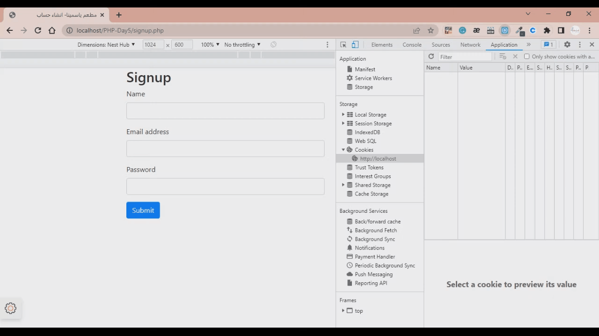

# Register/Login SessionID-authentication PHP
using PHP, i connected to MySQL to send the data of each regesitred student the database and then created a login page in which i start a session when the user is an authenticated user. I also added CRUD operations to the database to authenticate the login user. at the end i destroed the session and the cookie by logging uot

***Steps of how I have developed this Web app:***
1. I set up the server and conncted PHP to MySQL database.
2. I created a new database and a new table fot the users.
3. I created a form page for each user to register and created a login page.
4. I added CRUD operations to the database authenticate the login user.
5. I started a session when the user is an authenticated user
6. i destroed the session and the cookie by logging out

# Demo Preview

# Table of contents
- [Project Title](#register_login_sessionid_authentication_php)
- [Demo Preview](#demo-preview)
- [Table of contents](#table-of-contents)
